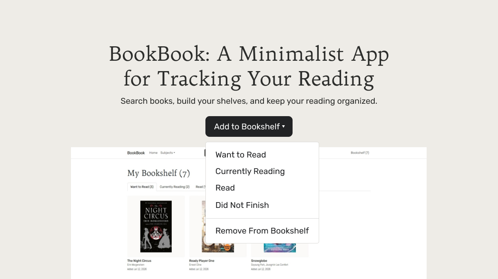
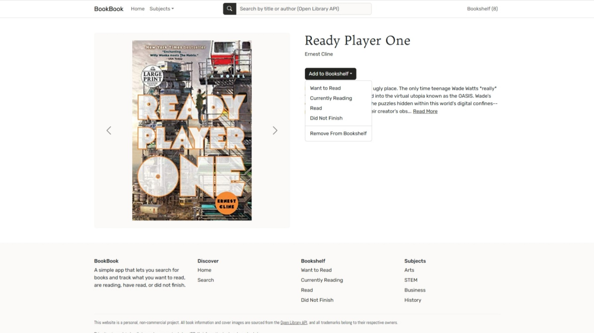
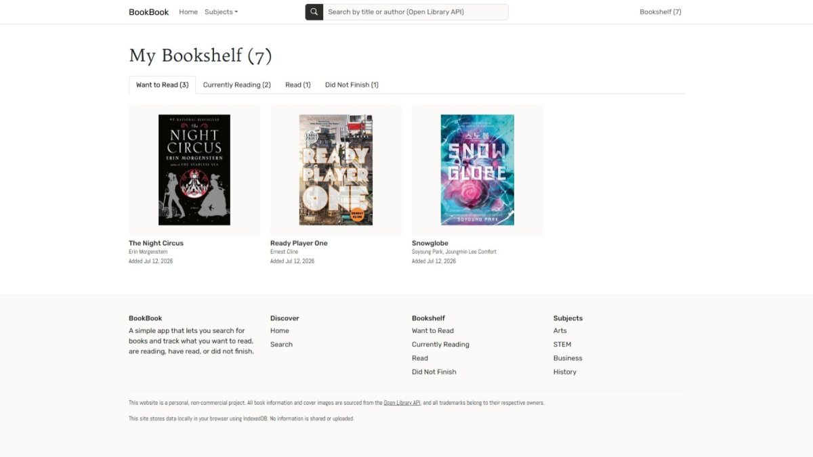
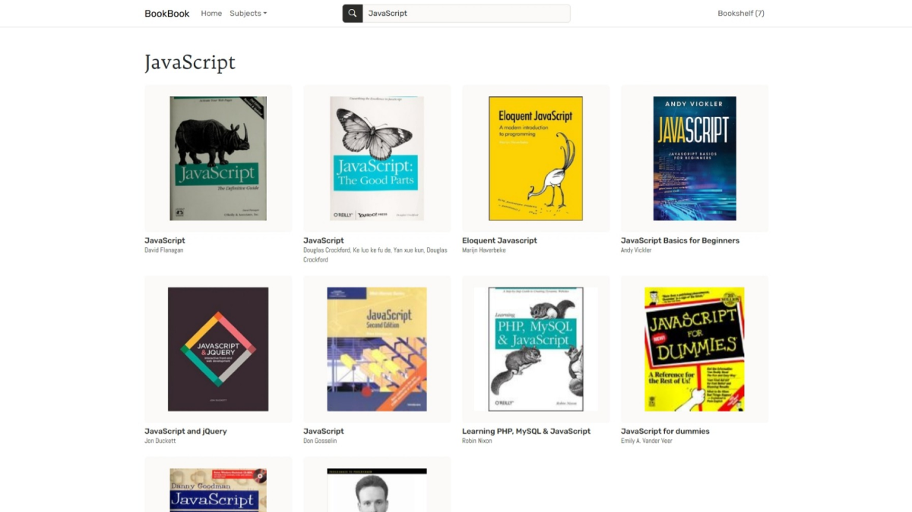

# BookBook: Book Tracker App


Search for books, add them to your reading lists, and keep track of your progress.
___

## Features
* Built with **ReactJS + Vite** using modern **JavaScript**, **React Hooks**, and **React Router DOM** for dynamic routes and query-based navigation
* Search by title/author via the **Open Library API**, with helper-based fetching and request-limit-aware handling
* Track books in four shelves (**Want to Read, Currently Reading, Read, Did Not Finish**) with seamless move/remove actions
* Styled using **Bootstrap** components customized with **Sass/CSS** (plus **HTML/CSS** foundations and Google Fonts)
* Better UX through loading skeletons, edge/error states, and read more/read less descriptions
* Uses **Dexie.js** (**IndexedDB**) for local persistence with seed/helper utilities, and is deployed on **Vercel**

___

## Demo
A live demo of the app is available at [bookbook-demo.vercel.app](https://bookbook-demo.vercel.app/).




___

## Installation

1. Clone the repo
```
git clone https://github.com/Riku737/Book-Tracker-App.git
cd Book-Tracker-App
```
2. Install dependencies
```
npm install
```
3. Start the development server
```
npm run dev
```
4. Open your browser at the port printed by the dev server (e.g., http://localhost:3000).
___

## Project Structure
```
/public
/src
    /assets
    /components         # UI components
    /db
        database.js     # Database set-up
        seeder.js       # Initial database data
    /pages         
    /services           # API calls to Open Library
    /styles             # SCSS / CSS
    App.jsx
    main.jsx
package.json
README.md
```